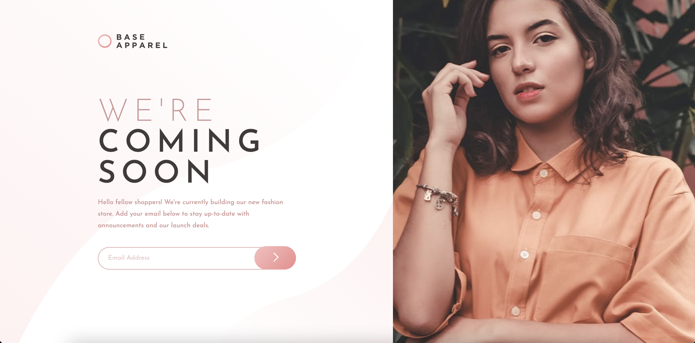

# Frontend Mentor - Base Apparel coming soon page solution

This is a solution to the [Base Apparel coming soon page challenge on Frontend Mentor](https://www.frontendmentor.io/challenges/base-apparel-coming-soon-page-5d46b47f8db8a7063f9331a0). Frontend Mentor challenges help you improve your coding skills by building realistic projects. 

## Table of contents

- [Overview](#overview)
  - [The challenge](#the-challenge)
  - [Screenshot](#screenshot)
  - [Links](#links)
- [My process](#my-process)
  - [Built with](#built-with)
  - [What I learned](#what-i-learned)
  - [Useful resources](#useful-resources)
- [Author](#author)

## Overview

### The challenge

Users should be able to:

- View the optimal layout for the site depending on their device's screen size
- See hover states for all interactive elements on the page
- Receive an error message when the `form` is submitted if:
  - The `input` field is empty
  - The email address is not formatted correctly

### Screenshot

### Links

- Solution URL: [https://www.frontendmentor.io/solutions/baseapparelcomingsoonmaster-VXkoyV_rO4](https://www.frontendmentor.io/solutions/baseapparelcomingsoonmaster-VXkoyV_rO4)
- Live Site URL: [https://coder-txane.github.io/base-apparel-coming-soon-master/](https://coder-txane.github.io/base-apparel-coming-soon-master/)

## My process

### Built with

- Semantic HTML5 markup
- CSS custom properties
- Flexbox
- Mobile-first workflow
- JavaScript form validation

### What I learned

I learned how to execute form validation with CSS and JavaScript. This was my first time doing this in a project. I have also grown confidence in using media queries and building responsive designs.

### Useful resources

- [FreeCodeCamp](https://www.freecodecamp.org/) - This website helped me grasp a good understanding of form validation!

## Author

- Frontend Mentor - [@coder-txane](https://www.frontendmentor.io/profile/coder-txane)
